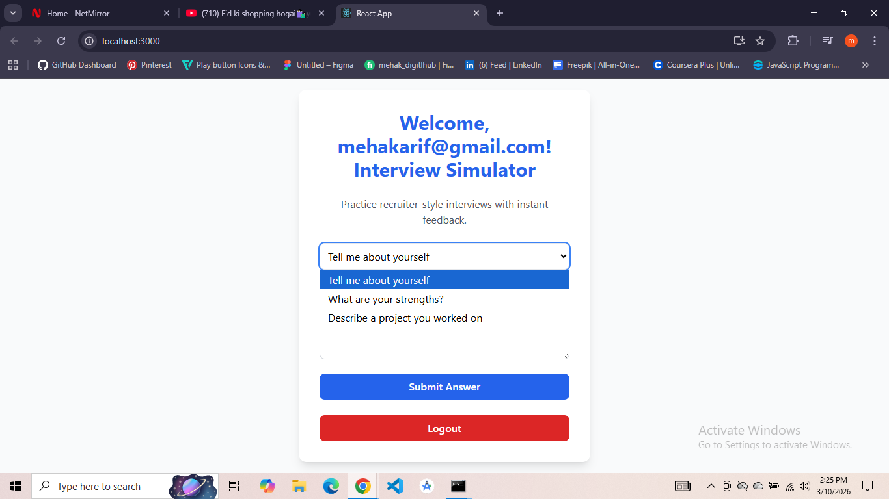
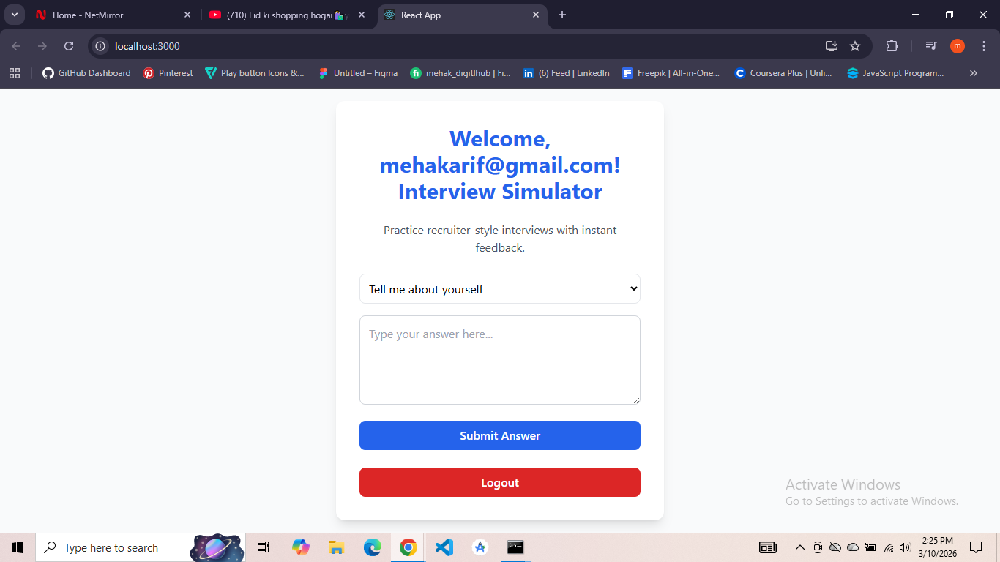
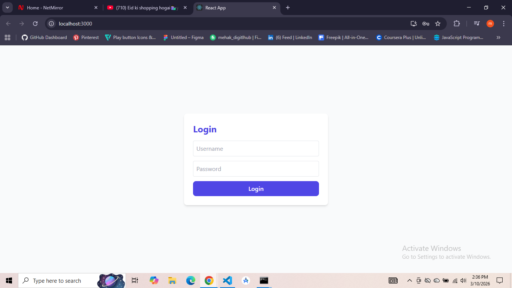
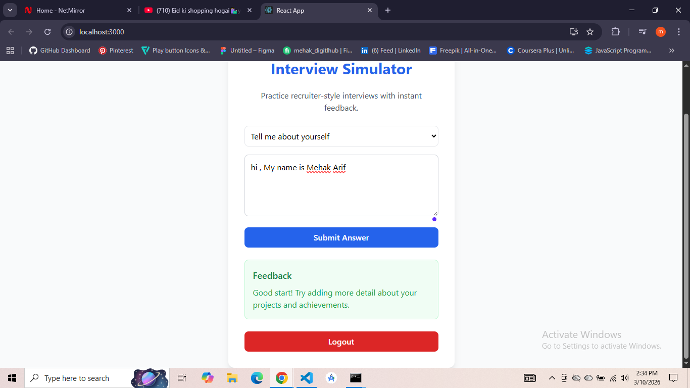

# Interview Simulator Project

This is a **fullstack project** built with **React (frontend)** and **Flask (backend)**.  
It simulates recruiter-style interviews where users can log in, answer common interview questions, and receive instant feedback.

---

## 📂 Project Structure
- `interview-simulator/` → React frontend (UI, login, questions, feedback display)
- `interview-backend/` → Flask backend (Python APIs for feedback)

---

## ✨ Features
- **Login/Logout system** → Simple username/password login stored in localStorage.
- **Interview questions dropdown** → Choose from common recruiter questions.
- **Answer submission** → Type your answer and submit.
- **Recruiter-style feedback** → Mock feedback returned instantly from backend.
- **Answer history** → Last answer and feedback saved in localStorage.
- **Polished UI** → TailwindCSS styling with recruiter-ready theme.

## 📸 Screenshots
## 📸 Screenshots

### Home Screen 1


### Home Screen 2


### Login Screen


### Recruiter Feedback



---

## ⚙️ Tech Stack
- **Frontend:** React + TypeScript + TailwindCSS
- **Backend:** Flask (Python) + Flask-CORS
- **Communication:** REST API (JSON)

---

## 🚀 Setup Instructions


```bash
cd interview-backend
python -m venv venv
venv\Scripts\activate   # Windows
source venv/bin/activate # Mac/Linux
pip install -r requirements.txt
python app.py

## Frontend(React)
cd interview-simulator
npm install
npm start


## 🖥️ Usage

Run backend and frontend servers.

Open frontend in browser (http://localhost:3000).

Login with any username/password.

Select a question → type your answer → click Submit Answer.

Instantly see recruiter-style feedback.

Logout anytime to return to login screen.

##📌 Notes
Python is used in the backend to build APIs with Flask.

Currently backend returns mock feedback (hardcoded recruiter-style response).

Real AI feedback (e.g., OpenAI GPT API) can be connected, but note:

Free trial APIs eventually expire.

To continue using them, you will need to purchase credits or subscription.

This repo is structured for easy recruiter demo and future expansion.

##👩‍💻 Author
Developed by Mehak — Fullstack Developer passionate about recruiter-ready apps, UI polish, and cultural branding.


---


